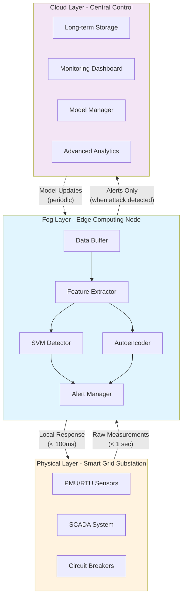
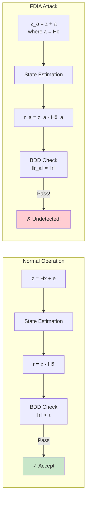
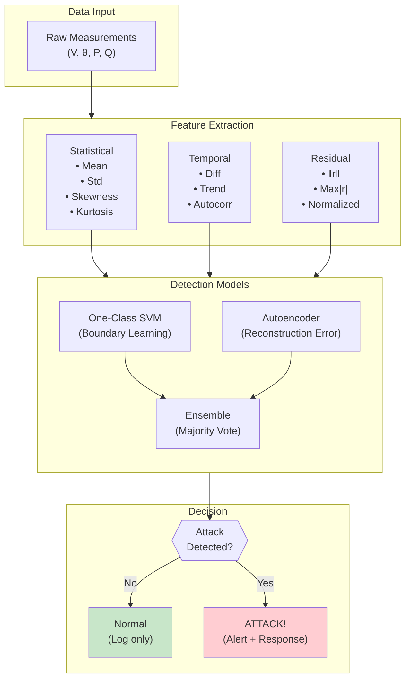
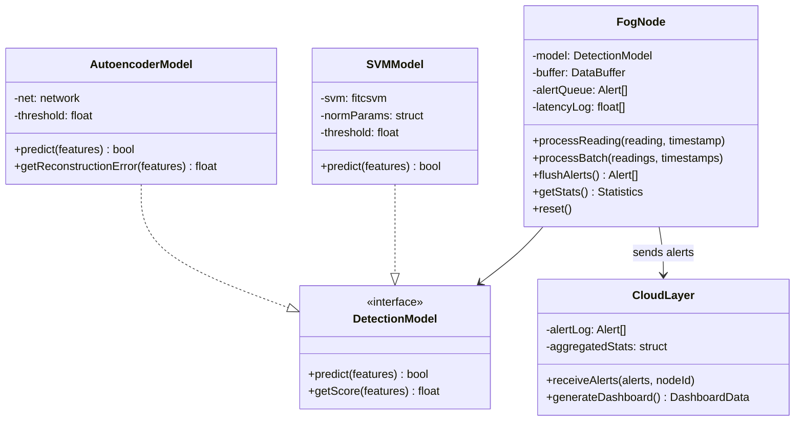
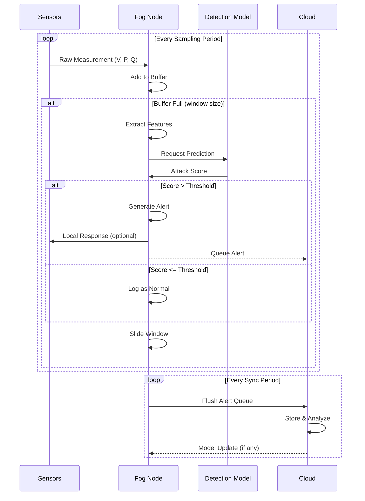
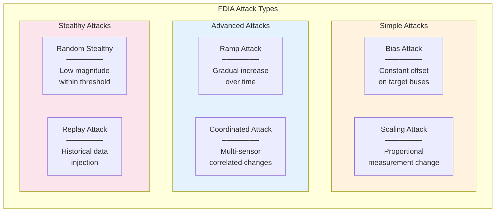
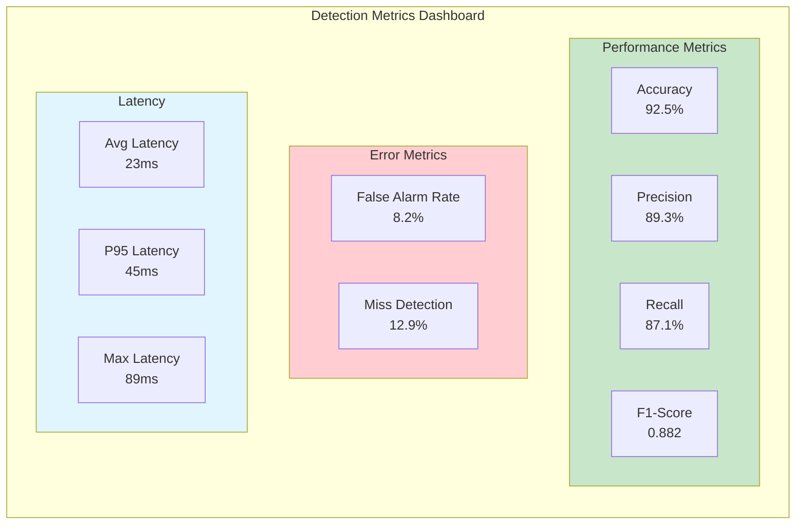
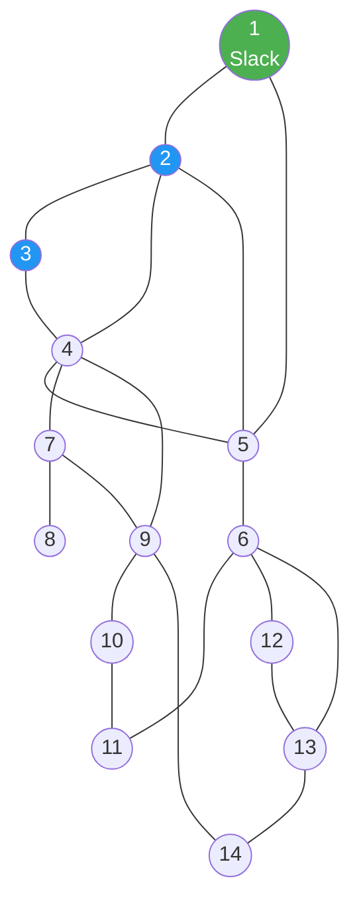

# System Architecture Documentation

Detailed architecture diagrams for the Fog-Assisted FDIA Detection System.

---

## 1. High-Level System Architecture

---

## 2. FDIA Attack Model

**Key Insight**: Attack `a = Hc` ensures residual unchanged, bypassing traditional detection.

---

## 3. Detection Pipeline

---

## 4. Fog Node Architecture

---

## 5. Data Flow Diagram

---

## 6. Attack Types Visualization

---

## 7. Metrics Dashboard Layout

---

## 8. IEEE 14-Bus Topology

**Legend**: 
- 🟢 Slack Bus (Reference)
- 🔵 PQ/PV Buses

---

## Summary

| Layer | Function | Latency Target |
|-------|----------|----------------|
| Physical | Data collection | Real-time |
| Fog | Detection + Local response | < 100ms |
| Cloud | Storage + Analytics | Non-critical |

**Key Principle**: Detection happens at the edge (fog), not the cloud, enabling fast response and reduced bandwidth.
